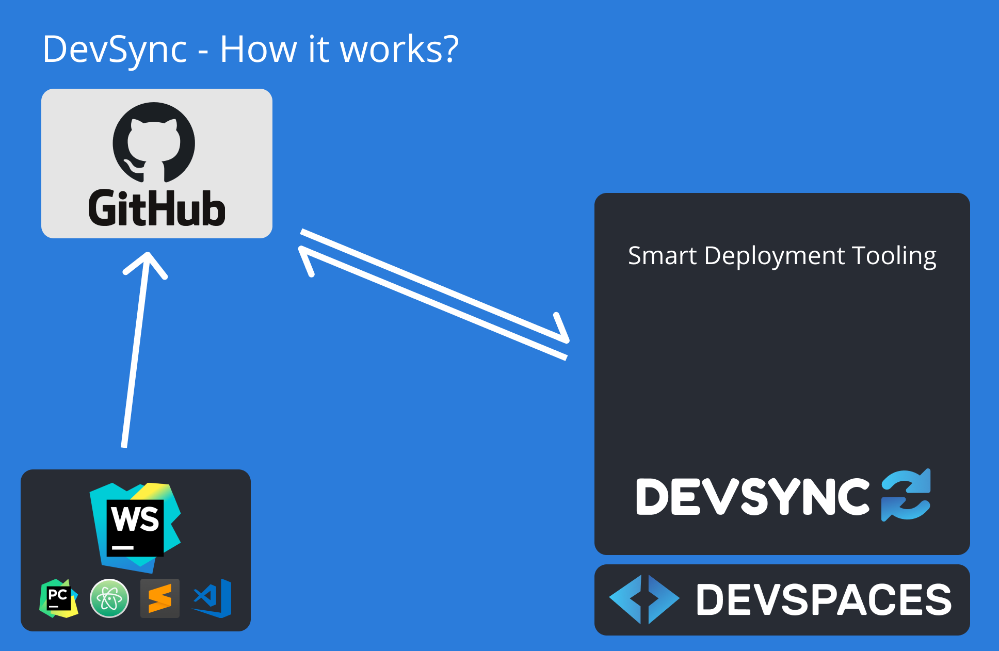

# DevSync

## The Problem

The adoption of a good tool that makes significant improvements to a developers workflow depends on how seamless the switch is.

As developers, we have strong opinions about languages, IDEs, terminals, themes, colors and all the bells and whistles that make us productive. DevSpaces approach to have VS code as the cloud IDE makes business sense, but can be a jarring experience for someone who has programs in different IDEs.

Furthermore, the native performance of a local IDE is probably going to be better, and more reliable. DevSpaces needs a way to get developers to adopt DevSpaces while still relying on their local IDEs to write code. Over time, developers would be increasing the time they spend on the cloud IDE.

This is where DevSync comes into the picture.

## DevSync - How it works?



## Milestone Map:

### Milestone 0: Feasibility Study:

1. Set an interval to trigger the run of a specific function at these intervals

Feasible, we can use setInterval like in the web

```ts
// TODO: Set Interval example
let count = 0;
setInterval(() => {
  // Display a message box to the user
  vscode.window.showInformationMessage(`Trigger count: ${count++}`);
}, 2000);
```

2. Get diff between currentCommit and latest upstreamCommit

Feasible, by extending the vscode git API

```ts
const gitExtension = vscode.extensions.getExtension<GitExtension>("vscode.git")
  ?.exports;
const api = gitExtension?.getAPI(1);
const repo = api?.repositories[0];
const head1 = repo?.state.HEAD;
const currentCommit = head1?.commit;

await repo?.fetch(head1?.upstream?.remote, head1?.upstream?.name);

const head2 = repo?.state.HEAD;

if (head2?.behind || 0 > 0) {
  await repo?.pull();

  const head3 = repo?.state.HEAD;
  const upstreamCommit = head3?.commit;

  if (!(currentCommit || upstreamCommit) || currentCommit === upstreamCommit) {
    return;
  }

  const changes = await repo?.diffBetween(
    currentCommit as string,
    upstreamCommit as string
  );
}
```

This shows the diff output as follows:

```json
[
  {
    "status": 5,
    "originalUri": {
      "$mid": 1,
      "path": "/c:/Users/ashwa/Desktop/Crossover/5k-voltdelta/README.md",
      "scheme": ""
    },
    "uri": {
      "$mid": 1,
      "path": "/c:/Users/ashwa/Desktop/Crossover/5k-voltdelta/README.md",
      "scheme": ""
    },
    "renameUri": {
      "$mid": 1,
      "path": "/c:/Users/ashwa/Desktop/Crossover/5k-voltdelta/README.md",
      "scheme": "file"
    }
  }
]
```

3. Run terminal commands from extension

Not feasible using child_process exec or any other Node API.
Feasible if you create a new terminal and use the sendText() API.

```ts
const terminal = vscode.window.createTerminal({
  name: "My Command",
  cwd: `${vscode.workspace.rootPath}/deploy`,
});

terminal.show();

terminal.sendText("npm run test");
```

### Milestone 1: Pull and get the two commits to be compared

````ts
const currentCommitHash = await exec("git rev-parse HEAD");
const gitStatus = await exec("git remote update && git status -uno");

// If your branch is already on the latest, then do nothing
if (!/Your branch is behind/.test(gitStatus)) return;

await exec("git pull");
const latestCommitHash = await exec("git rev-parse HEAD");
const authorEmail = await exec(
  `git show -s --format='%ae' ${latestCommitHash}`
);
```

### Milestone 2:

## Dev Guide:

1. Run extension in VS Code by pushing `F5`
2. Open command palette (Ctrl + Shift + P) and run the command "DevSync"

To package extension: `vsce package`

Need a solution to have the extension, auto installed. Probably can do this,

1. Upload extension to s3 bucket
2. In devspace docker setup / init, copy the file from bucket
3. Run `code --install-extension devsync-0.0.1.vsix`

## Notes:

````

"activationEvents": [
"onStartupFinished"
]

```

```

"extensionDependencies": [
"vscode.git"
],

````

[Expose config to be set in user settings](https://code.visualstudio.com/api/references/contribution-points#contributes.configuration)

[Packaging extension into VSIX](https://code.visualstudio.com/api/working-with-extensions/publishing-extension#packaging-extensions)

[VS CodeSpaces](https://github.com/MicrosoftDocs/vscodespaces)

- Shared user, multiple people -> push their commits on the same branch
- Store what was deployed earlier somewhere
- START ==> SEND MESSAGE
- END ==> SEND MESSAGE WITH COMMIT HASH
- Interactive prompt in case of manual override requirement
- `Better safe than sorry` principle
- Anecdote about my pattern of usage
- Auto deploy makes it easier on a newbee
- How to auto run extension on launch?
- Offloading the thought process (SCRATCH.md) => Monkey coding
- Configurable tooling, not smart
- Auto create branch from github? Or CLI tool to run create
- Auto capture and write command outputs somewhere
- Can we get main terminal and close processes or switch terminal etc.?
- Update feasibility study failure point

## Brainstorming

Auto download from S3 bucket and setup extension

Deploy:

- package.json
- Backend:
- lambdas
- graphql
- sq
  Frontend:
- assets

`deploy/*` =>
`*.spec.ts` =>

Each file can be matched only once
Maintain order
Identify if there's anyway to detect if destroy has to be run
Commands will not be run multiple times

```json
{
  "deploy/package.json": ["npm run deploy:install"],
  "lambda/package.json": ["npm run lambda:install"],
  "frontend/package.json": ["npm run frontend:install"],
  "graphql/*": ["npm run graphql:codegen"],
  "deploy/*": [
    { "manualOverride": ["npm run destroy:backend"] },
    "npm run deploy:backend",
    "npm run data:seed"
  ],
  "sql/*": [
    { "skipIfCommand": ["npm run destroy:backend", "npm run deploy:backend"] },
    "npm run database:drop",
    "npm run database:create",
    "npm run data:seed"
  ],
  "lambda/*": ["npm run deploy:backend"],
  "frontend/assets": ["npm run deploy:assets"],
  "frontend/*": ["npm run frontend:start"],
  "backend/**/*.spec.js": [
    { "separateTab": true, "parallel": true },
    "npm run backend:test"
  ],
  "frontend/**/*.spec.js": [
    { "separateTab": true, "parallel": true },
    "npm run frontend:test"
  ]
}
````
