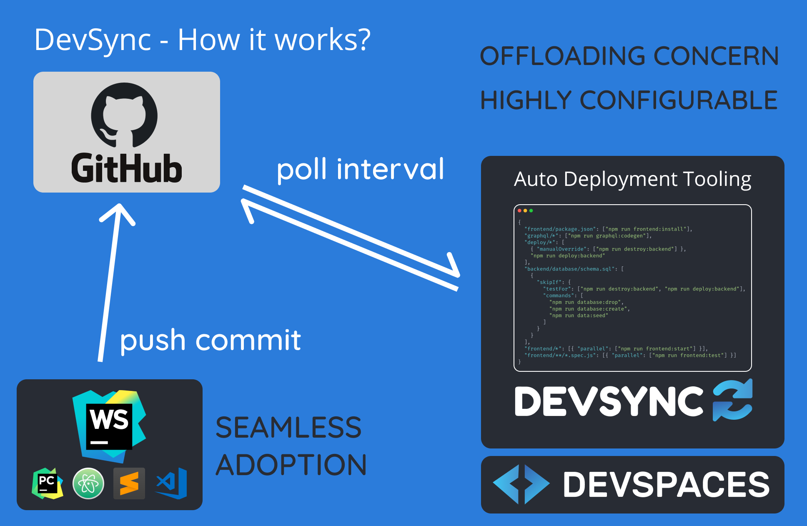

# DevSync

## The Problem

The adoption of a good tool that makes significant improvements to a developers workflow depends on how seamless the switch is.

As developers, we have strong opinions about languages, IDEs, terminals, themes, colors and all the bells and whistles that make us productive. DevSpaces approach to have VS code as the cloud IDE makes business sense, but can be a jarring experience for someone who has programs in different IDEs.

Furthermore, the native performance of a local IDE is probably going to be better, and more reliable. DevSpaces needs a way to get developers to adopt DevSpaces while still relying on their local IDEs to write code. Over time, developers would be increasing the time they spend on the cloud IDE.

This is where DevSync comes into the picture.

## DevSync - How it works?



## Milestone Map:

### Milestone 1: Pull and get the two commits to be compared

```ts
const currentCommitHash = await exec("git rev-parse HEAD");
const gitStatus = await exec("git remote update && git status -uno");

// If your branch is already on the latest, then do nothing
if (!/Your branch is behind/.test(gitStatus)) return;

await exec("git pull");
const latestCommitHash = await exec("git rev-parse HEAD");
const authorEmail = await exec(
  `git show -s --format='%ae' ${latestCommitHash}`
);
```

### Milestone 2: Get configuration from user settings

```ts
"configuration": {
  "title": "Devsync",
  "properties": {
    "devsync.email": {
      "type": "string",
      "default": null,
      "description": "Emails that are allowed to make auto deploy commits"
    },
    "devsync.logic": {
      "type": "object",
      "default": {},
      "description": "Configuration logic that devsync must follow when handling your commits"
    },
    "devsync.interval": {
      "type": "integer",
      "default": 10,
      "description": "Interval at which devsync should poll for changes"
    }
  }
}
```

Example logic object:

```json
{
  "deploy/package.json": ["npm run deploy:install"],
  "lambda/package.json": ["npm run lambda:install"],
  "frontend/package.json": ["npm run frontend:install"],
  "graphql/*": ["npm run graphql:codegen"],
  "deploy/*": [
    { "manualOverride": ["npm run destroy:backend"] },
    "npm run deploy:backend",
    "npm run data:seed"
  ],
  "backend/database/schema.sql": [
    {
      "skipIf": {
        "testFor": ["npm run destroy:backend", "npm run deploy:backend"],
        "commands": [
          "npm run database:drop",
          "npm run database:create",
          "npm run data:seed"
        ]
      }
    }
  ],
  "lambda/*": ["npm run deploy:backend"],
  "frontend/assets/*": ["npm run deploy:assets"],
  "frontend/*": [{ "parallel": ["npm run frontend:start"] }],
  "backend/**/*.spec.js": [{ "parallel": ["npm run backend:test"] }],
  "frontend/**/*.spec.js": [{ "parallel": ["npm run frontend:test"] }]
}
```


### Milestone 3: Run extension checks in interval

```ts
setInterval(async () => {
  // Poll to see if commits have been pushed to the repo
}, configuration.interval * 1000);
```

### Milestone 4: Store commands to run (for simple file matches)

```ts
// The commands to run in order
const commandsToRun: string[] = [];

Object.entries(configuration.logic).forEach((entry) => {
  // Simple file match
  if (!/\*/.test(entry[0])) {
    // No *, so it is a simple file
    const filePath = entry[0];

    if (diffArr.includes(filePath)) {
      const commands = (entry[1] as unknown) as any[];

      for (const command of commands) {
        if (typeof command === "string" && !commandsToRun.includes(command)) {
          commandsToRun.push(command);
        }
      }
    }
  }
});
```

### Milestone 5: Store commands to run for parent folder matches

```ts
// The commands to run in order
const commandsToRun: string[] = [];

const parseCommands = (entry: any) => {
  const commands = (entry[1] as unknown) as any[];
  for (const command of commands) {
    if (typeof command === "string" && !commandsToRun.includes(command)) {
      commandsToRun.push(command);
    }
  }
};

Object.entries(configuration.logic).forEach((entry) => {
  // Simple file match
  if (!/\*/.test(entry[0])) {
    // No *, so it is a simple file
    const filePath = entry[0];

    // If one of the file path matches with diff array, parse and store commands
    if (diffArr.includes(filePath)) parseCommands(entry);
  } else if (entry[0].includes("**/*")) {
    // Match file in any sub folder with specific extension
    // ^frontend\/(?:.*).spec\.js$
    const pattern = new RegExp(
      `^${entry[0]
        .replace("/", "\\/")
        .replace(".", ".")
        .replace("**/*", "(?:.*)")}`
    );

    // If one of the file path matches with diff array, parse and store commands
    if (diffArr.some((file) => pattern.test(file))) parseCommands(entry);
  } else {
    // Match any file inside directory
    // ^deploy\/.*$
    const pattern = new RegExp(
      `^${entry[0].replace("/", "\\/").replace("*", ".*$")}`
    );

    // If one of the file path matches with diff array, parse and store commands
    if (diffArr.some((file) => pattern.test(file))) parseCommands(entry);
  }
});

log(commandsToRun);
```

### Milestone 6: Implement manualOverride and skipIf flag logic & Milestone 7: Implement parallel flag logic

```ts
/**
 * We will check for the special flag being passed
 * Currently, we have support for the following flags:
 * - manualOverride: Prompt user for confirmation before running
 * - skipIf: {testFor: [], commands: []}: Skip the next set of commands
 * - separateTab: Run command in separate tab (for example, if you previously ran start,
 *   you dont want to run test in the same tab since they both dont terminate on completion)
 */
const key = Object.keys(command)[0];

switch (key) {
  case "manualOverride":
    for (const subCommand of command.manualOverride) {
      const response = await window.showInformationMessage(
        `Do you want to run '${subCommand}' ?`,
        { modal: true },
        "Yes",
        "No"
      );

      if (response === "Yes") {
        window.showInformationMessage(`Running command: ${subCommand}`);
        await exec(subCommand, channel);
        commandsThatHaveBeenRun.push(subCommand);
      }
    }
    break;
  case "skipIf":
    const { testFor, commands: skipCommands } = command.skipIf;

    // If one of the testFor commands have been run previously,
    // then we skip all commands in this step
    const testForCheck = testFor.some((subCommand: any) =>
      commandsThatHaveBeenRun.includes(subCommand)
    );

    if (testForCheck) {
      break;
    }

    for (const subCommand of skipCommands) {
      window.showInformationMessage(`Running command: ${subCommand}`);
      await exec(subCommand, channel);
      commandsThatHaveBeenRun.push(subCommand);
    }

    break;
  case "parallel":
    for (const subCommand of command.parallel || []) {
      sendMessageToTerminal(subCommand);
    }
    break;
  default:
    break;
}
```

## Dev Guide:

1. Run extension in VS Code by pushing `F5`
2. Open command palette (Ctrl + Shift + P) and run the command "DevSync"

To package extension: `vsce package`

Need a solution to have the extension, auto installed. Probably can do this,

1. Upload extension to s3 bucket
2. In devspace docker setup / init, copy the file from bucket
3. Run `code --install-extension devsync-0.0.1.vsix`

## Notes:

````

"activationEvents": [
"onStartupFinished"
]

```

```

"extensionDependencies": [
"vscode.git"
],

````

[Expose config to be set in user settings](https://code.visualstudio.com/api/references/contribution-points#contributes.configuration)

[Packaging extension into VSIX](https://code.visualstudio.com/api/working-with-extensions/publishing-extension#packaging-extensions)

[VS CodeSpaces](https://github.com/MicrosoftDocs/vscodespaces)

- Shared user, multiple people -> push their commits on the same branch
- Store what was deployed earlier somewhere
- START ==> SEND MESSAGE
- END ==> SEND MESSAGE WITH COMMIT HASH
- Interactive prompt in case of manual override requirement
- `Better safe than sorry` principle
- Anecdote about my pattern of usage
- Auto deploy makes it easier on a newbee
- How to auto run extension on launch?
- Offloading the thought process (SCRATCH.md) => Monkey coding
- Configurable tooling, not smart
- Auto create branch from github? Or CLI tool to run create
- Auto capture and write command outputs somewhere
- Can we get main terminal and close processes or switch terminal etc.?
- Update feasibility study failure point

## Brainstorming

Auto download from S3 bucket and setup extension

Deploy:

- package.json
- Backend:
- lambdas
- graphql
- sq
  Frontend:
- assets

`deploy/*` =>
`*.spec.ts` =>

Each file can be matched only once
Maintain order
Identify if there's anyway to detect if destroy has to be run
Commands will not be run multiple times
